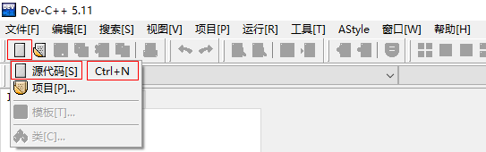
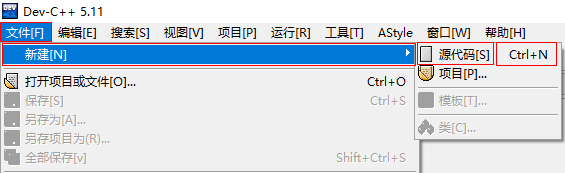
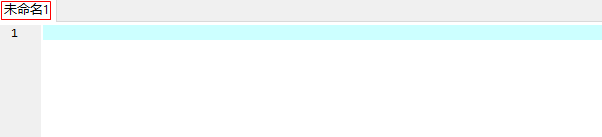
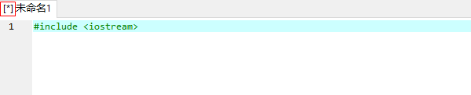
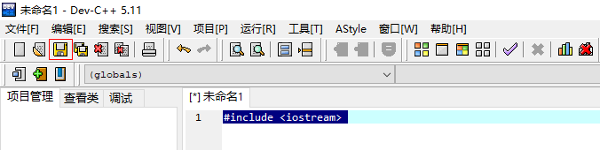
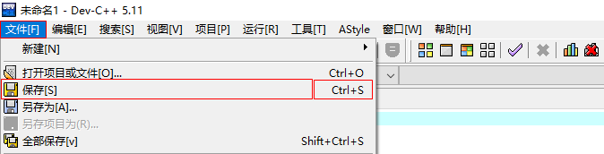
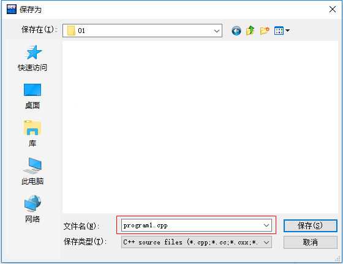
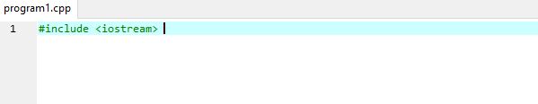
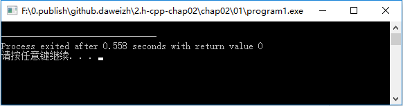
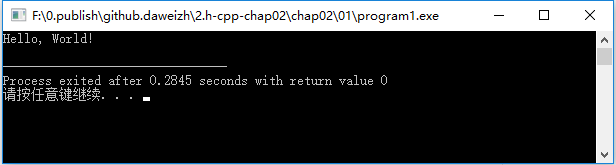

# A01.01 Hello, World!

- 张大为 QQ:1243605845 @大连
- 辽宁师范大学计算机与信息技术学院
- [https://daweizh.github.io/cpp/](https://daweizh.github.io/cpp/) 

## step1

可以通过以下方式在**Dev-C++ IDE**中新建源码文件：

1. 通过工具**按钮**新建源码文件   
	
2. 通过**文件**菜单新建源码文件   
	
3. 通过**Ctrl+n**新建源码文件   

出现如下图**未命名1**文件编辑区，**未命名**表示没存盘。

输入一行代码

~~~cpp
#include <iostream> 
~~~

文件标题前出现**[\*]**表示文件有改动，且没存盘，如下图所示

可以通过以下方式保存文件：

1. 通过工具**按钮**保存文件   
	
2. 通过**文件**菜单保存文件   
	
3. 通过**Ctrl+s**保存文件
	
第一次保存文件会出现如下对话框让你选择**文件保存目录**和输入**文件名**，如下图所示

选择保存路径为**x:/idea/cpp/chap02/01**, 输入文件名为**program1.cpp** ， 点击**保存**按钮，当前编辑区标题变为**program1.cpp** ，并且没有**[\*]**号出现。

正在修改中的程序文件应随时按**Ctrl+s**保存！

## step2

书写程序主入口函数框架

~~~cpp
#include <iostream> 

int main(){
	
	return 0;
}
~~~

按**Ctrl+s**保存，按**F9**编译，按**F11**编译执行，出现如下窗口表明程序执行成功。

按键盘上任意一个键，该窗口消失。

## step3

增加代码行`std::cout << "Hello, World!" << std::endl;`，输出“Hello, World!”。

~~~cpp
#include <iostream>
    
int main() {
    std::cout << "Hello, World!" << std::endl;
    return 0;
}
~~~

按**Ctrl+s**保存，按**F11**编译执行，出现如下窗口表明程序执行成功。

按键盘上任意一个键，该窗口消失。

## step4

增加代码行`using namespace std;`，简化`std`前缀

~~~cpp
#include <iostream>
using namespace std;
    
int main(){
    cout << "Hello, World!" << endl;
    return 0;
}
~~~

## step5 

把"Hello, World!"换成如下内容试试：

1. 1+2
	~~~cpp
    cout << 1+2 << endl;
	~~~
2. 3*3
	~~~cpp
    cout << 3*3 << endl;
	~~~
3. 4-3
	~~~cpp
    cout << 4-3 << endl;
	~~~
4. 4/2
	~~~cpp
    cout << 4/2 << endl;
	~~~

把上述4行都写上怎样？

~~~cpp
#include <iostream>
using namespace std;
    
int main(){
    cout << "Hello, World!" << endl;
    cout << 1+2 << endl;
    cout << 3*3 << endl;
    cout << 4-3 << endl;
    cout << 4/2 << endl;
    return 0;
}
~~~

## step6

自己想想再让计算机输出点什么？

## w. 微信订阅号

1. 智数精英-关注中小学程序设计及相关讨论
2. 随话录-记录小朋友们的成长时光
2. 西山征途-关注大学生成长、学习和生活

----------

## b. [返回](../)
    
## h. [首页](../../)

 