# 《编程基础实践》课程资源空间

- 张大为 QQ:1243605845 @大连
- 辽宁师范大学计算机与信息技术学院
- [https://daweizh.github.io/cpp/](https://daweizh.github.io/cpp/)  

## step1 进入《编程基础实践》课程资源空间

1. 通过下面网络地址进入**教学资源云平台**：
	1. http://210.47.218.146:8080
	2. http://tpss.cits.lnnu.edu.cn:8080/
	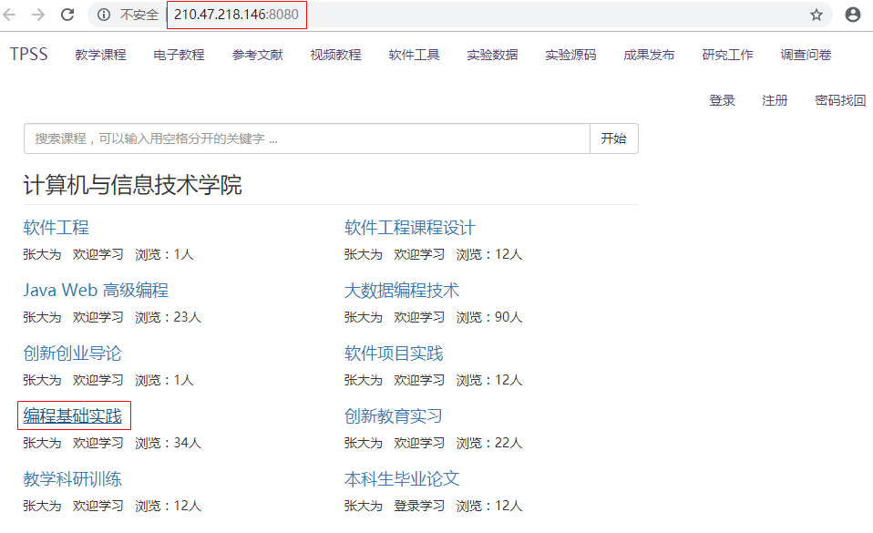

2. 点击**编程基础实践**，进入课程资源空间
	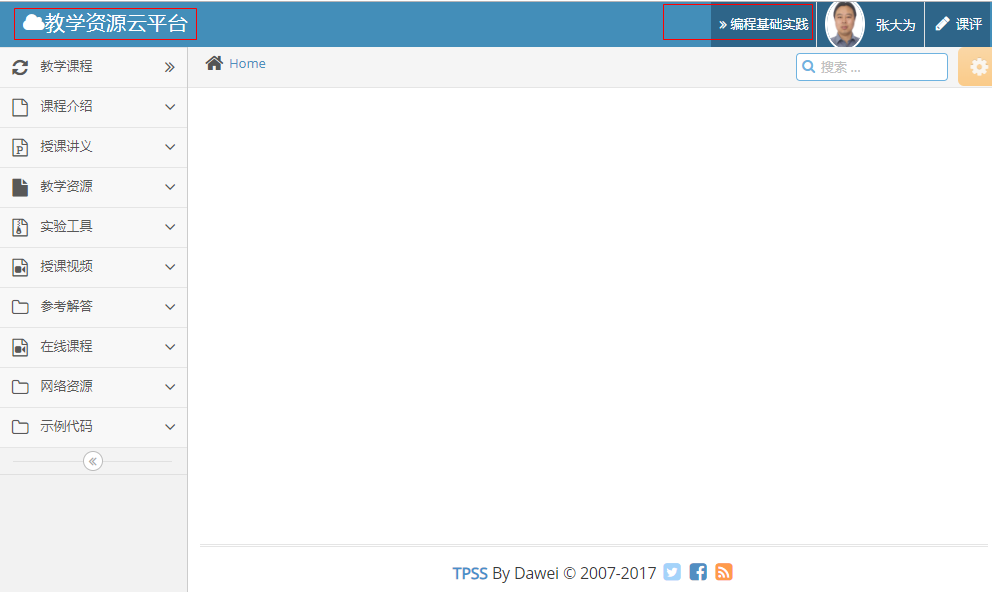

## step2 浏览教学资源

1. 参考书
	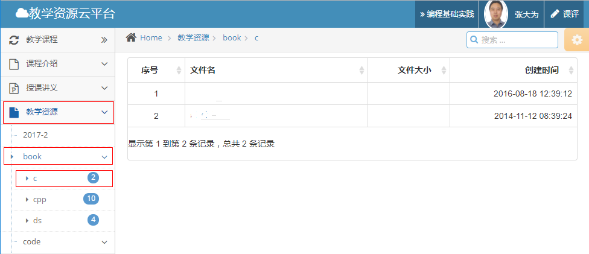
2. 书中代码
	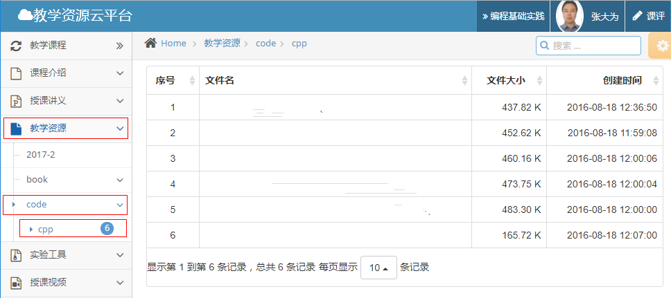

## step3 浏览实验工具

1. Chrome浏览器
	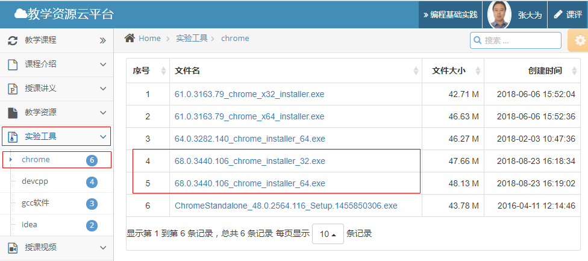
2. DevCPP编程环境
	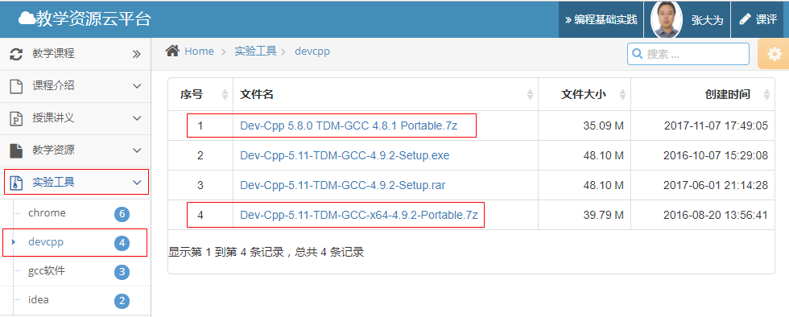
3. idea集成环境
	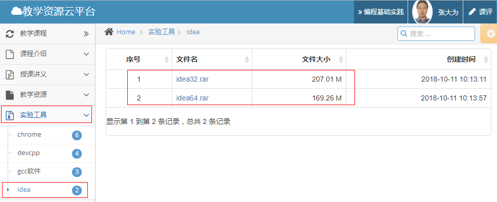

## step4 讲解视频

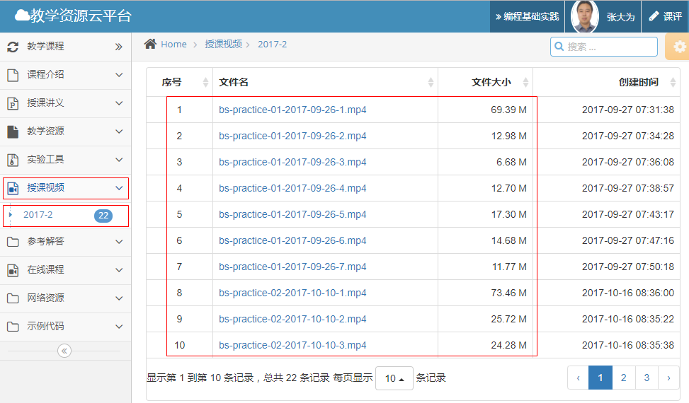

## step5 参考解答

1. noi.openjudge.cn
	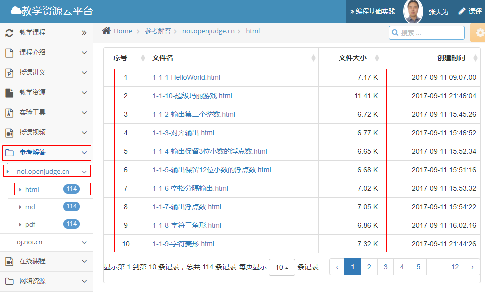
2. oj.noi.cn
	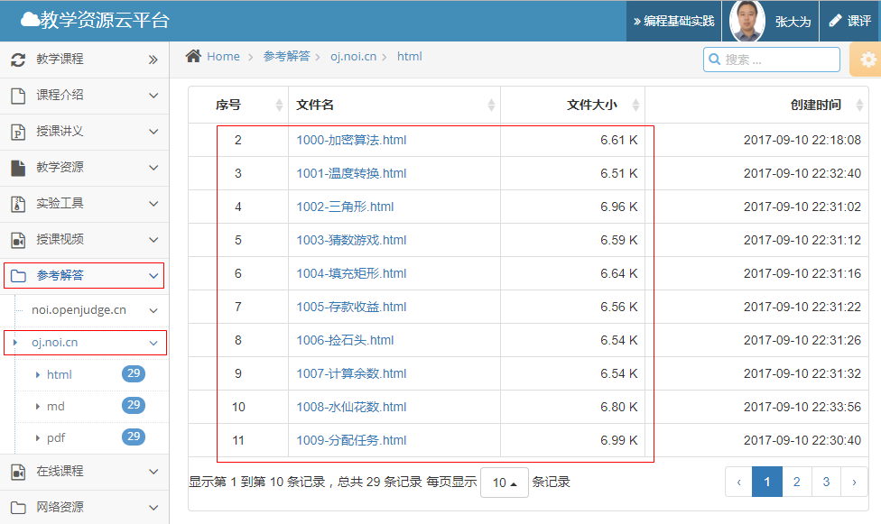

## step6 在线课程

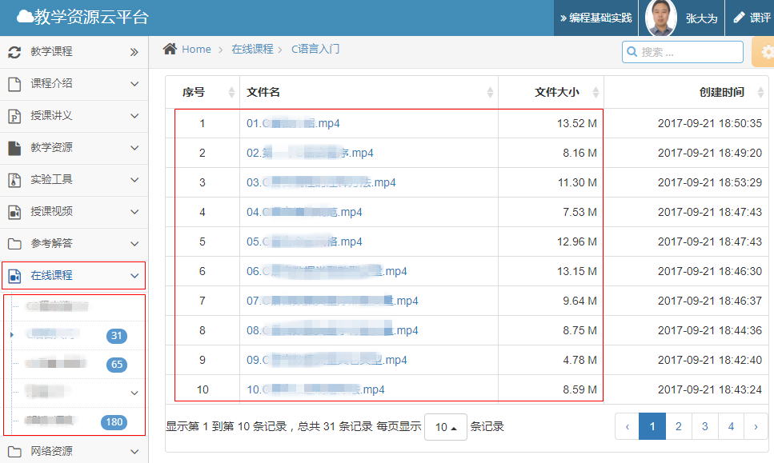

## step7 网络题库

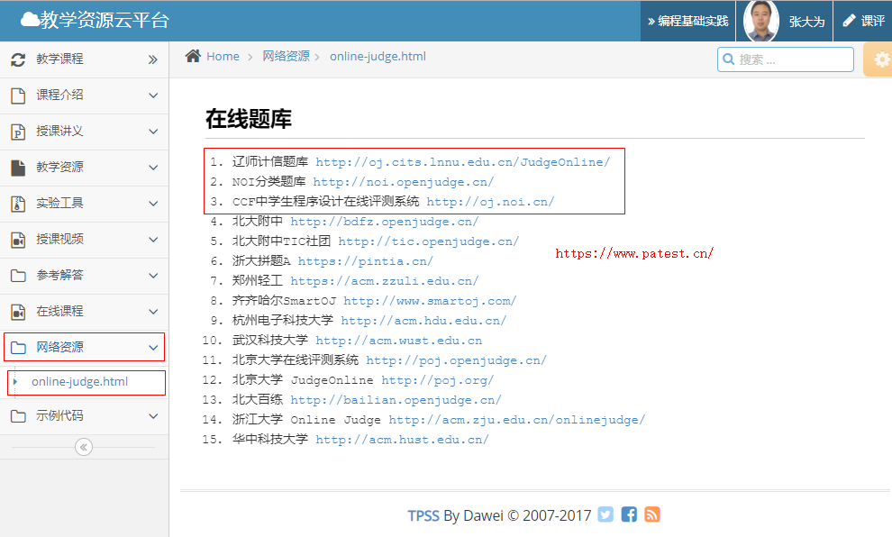

## w.微信订阅号

1. 智数精英-关注中小学程序设计及相关讨论
2. 随话录-记录小朋友们的成长时光
2. 西山征途-关注大学生成长、学习和生活

----------

## b.[返回首页](../../)
    
    
