# 建立DevCpp编程环境

- 张大为 QQ:1243605845 @大连
- 辽宁师范大学计算机与信息技术学院
- [https://daweizh.github.io/cpp/](https://daweizh.github.io/cpp/)  

## step1 查看操作系统类型

1. **桌面**上鼠标右键**此电脑**图标，在快捷菜单中选择**属性**   
	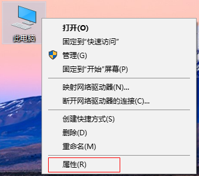
2. 看操作系统类型是32位，还是64位，XP系统是32位    
	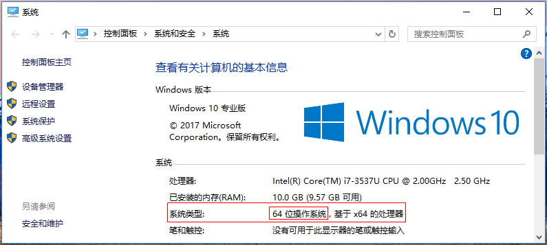

## step2 下载idea集成编程环境

1. 进入**教学资源云平台**网站[http://210.47.218.146:8080/](http://210.47.218.146:8080/)
2. 点击**编程基础实践**进入C语言学习资源空间   
	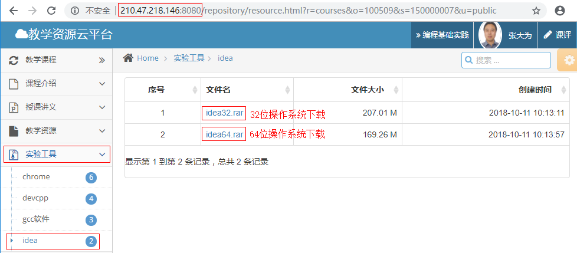
3. 根据操作系统类型下载具体的**idea##.rar**   
	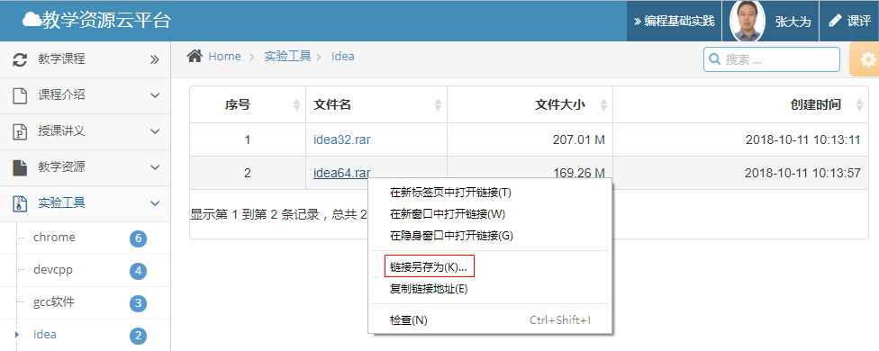
4. 保存文件到**D盘**   
	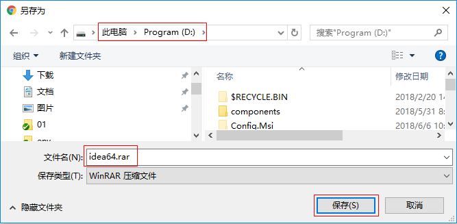

## step3 解压idea集成环境

1. 鼠标右键下载好的压缩包，选择**解压到当前文件夹**     
	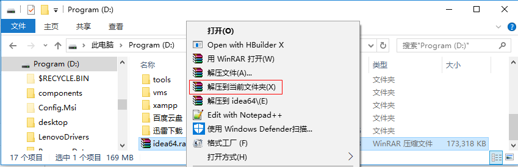
2. 浏览目录结构
	~~~
	D:\IDEA64
	├─cpp                                                  	//用于保存代码源文件
	├─tools
	│      68.0.3440.106_chrome_installer_64.exe		   	//chrome浏览器安装文件
	│      Dev-Cpp 5.11 TDM-GCC x64 4.9.2 Portable.7z		//devcpp免安装文件
	│      npp.7.5.8.bin.x64.zip							//notepad++免安装文件
	│      npp.7.5.8.Installer.x64.exe						//notepad++安装文件
	└─wedo
	    ├─Dev-Cpp
	    │  └─devcpp.exe										//鼠标双击该文件启动DevCPP编程环境
	    └─npp
	        └─notepad++.exe									//鼠标双击打开notepad++编辑器
	~~~
3. 双击**devcpp.exe**打开DevCpp编程环境    
	

## step4 第一次启动DevCpp

1. 选择界面语言，选择中文    
	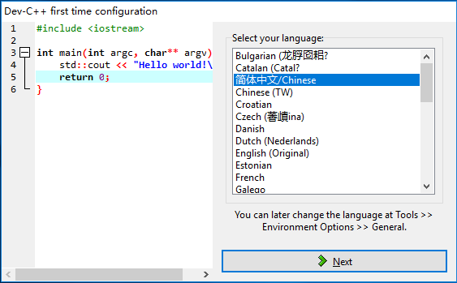
2. 选择代码颜色方案，保持默认    
	
3. 点击**OK**，完成启动设置，进入开发环境    
	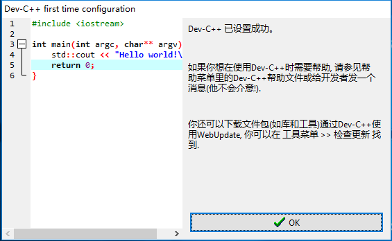

## step5 编写第一个CPP程序

1. 根据操作系统类型位数选择编译类型    
	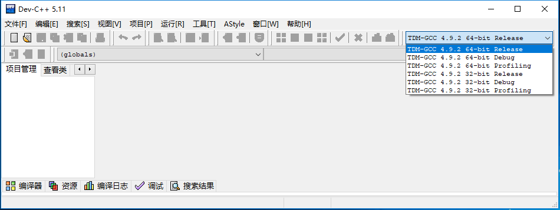
2. **Ctrl+n**写第一个程序    
	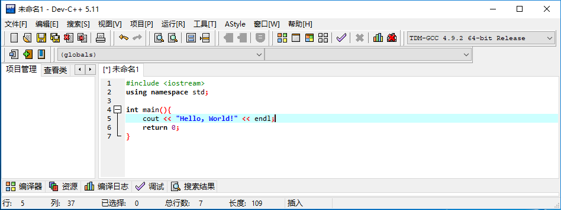
3. **Ctrl+s** 保存文件 **D:/idea##/cpp** 文件夹下，要起**有意义的文件名**    
	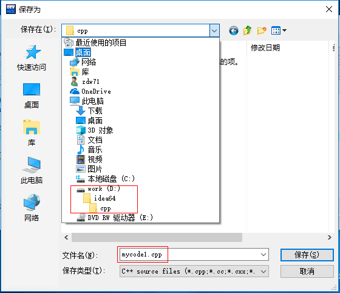
4. 按**F11**键执行第一个程序    
	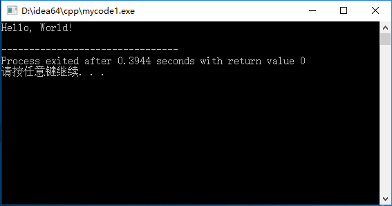

## w.微信订阅号

1. 智数精英-关注中小学程序设计及相关讨论
2. 随话录-记录小朋友们的成长时光
2. 西山征途-关注大学生成长、学习和生活

----------

## b.[返回](../)

## h.[首页](../../)
    
    
