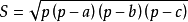
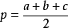

# Q03.17 计算三角形面积

总时间限制: 1000ms 内存限制: 65536kB

## 题目描述

平面上有一个三角形，它的三个顶点坐标分别为(x1, y1), (x2, y2), (x3, y3)，
那么请问这个三角形的面积是多少。

## 输入

输入仅一行，包括6个单精度浮点数，分别对应x1, y1, x2, y2, x3, y3。

## 输出

输出也是一行，输出三角形的面积，精确到小数点后两位。

## 样例输入

    0 0 4 0 0 3

## 样例输出

    6.00

## 数据范围限制

## 提示
   
海伦公式:

假设在平面内，有一个三角形，边长分别为a、b、c，三角形的面积S可由以下公式求得：

而公式里的p为半周长（周长的一半）：

 

## w. 微信订阅号

1. 智数精英-关注中小学程序设计及相关讨论
2. 随话录-记录小朋友们的成长时光
3. 西山征途-关注大学生成长、学习和生活

----------

## b. [返回](../)
    
## h. [首页](../../)

